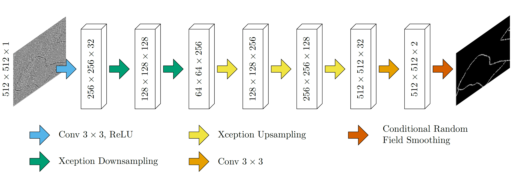

# Mapping drainage ditches in forested landscapes using deep learning and aerial laser scanning
This project aims to map small ditches from high resolution LiDAR data using deep learning

Extensive use of drainage ditches in European boreal forests and in some parts of North America has resulted in a major shift in the wetland and soil hydrology and impacted the overall ecosystem functions of these regions. An Increasing understanding of the environmental risks associated with forest ditches makes mapping these ditches a priority for sustainable forest and land use management. Here, we present the first rigorous deep learning-based methodology to map forest ditches at regional scale.  A deep neural network was trained on airborne laser scanning data and 1607 km of manually digitized ditch channels from 10 regions spread across Sweden. The model correctly mapped 86 % of all ditch channels in the test data with a Matthew's correlation coefficient of 0.78. Further, the model proved to be accurate when evaluated on LiDAR data from other heavily ditched countries in the Baltic Sea Region. Visual inspection indicates that this method often also classifies natural stream channels as ditches, suggesting that deep neural networks can be trained to detect such channels in addition to drainage ditches.  The presented study will lead the way in using deep learning and LiDAR technologies for mapping fine-resolution drainage ditches over large areas. It, thus, provides a significant contribution to the assessment of regional hydrology and ecosystem dynamics in forested landscapes.

Authors: William Lidberg, Siddhartho Shekhar Paul, Florian Westphal, Kai Florian Richter, Niklas Lavesson, Raitis Melniks, Janis Ivanovs, Mariusz Ciesielski, Antti Leinonen, Anneli M. Ågren 

The data is avalible from Mendely data:

Ågren, A.M., Paul, Shekhar, S., Lidberg, W. (2021), “Mapped drainage ditches in forested landscapes”, Mendeley Data: https://data.mendeley.com/datasets/zxkg43jsx8/draft?a=626084b8-5664-425a-80a7-8f143370fb62, V1, doi reserved but not active: 10.17632/zxkg43jsx8.1

